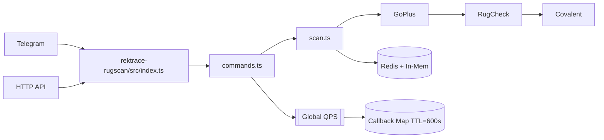

# Rektrace Research Consolidation Report
> Single source of truth for codebase research phase | 2025-08-20

## 1. Codebase Map Summary

| **Service** | **Entrypoint** | **Port** | **Runtime** | **Key Modules** |
|-------------|----------------|----------|-------------|-----------------|
| Core API | [`src/index.ts`](src/index.ts:1) | 3000 | Node 20 | payments, cache, metrics |
| Rugscan Bot | [`rektrace-rugscan/src/index.ts`](rektrace-rugscan/src/index.ts:1) | 3000 | Node 20 | commands, scan, enrich, alerts |
| Webhook Server | [`servers/webhook.ts`](servers/webhook.ts:1) | 3001 | Node 20 | webhook handlers |
| MCP Tools | 6 servers in [`mcp/`](mcp/:1) | various | Node 20 | git-tools, http-probe, metrics |

**Tooling Stack**: PM2 cluster, Docker, Jest/Vitest, Justfile, CMake (cpp_demo)

## 2. Architecture Diagram
Reference: [`docs/architecture.mmd`](docs/architecture.mmd:1)

## 3. Security Findings (High-Level)

| **Category** | **Status** | **Evidence** |
|--------------|------------|--------------|
| Demo wall | ✅ | `DEMO_MODE=true` blocks live providers |
| Rate limiting | ✅ | Global QPS + per-IP optional |
| Secrets | ⚠️ | In `.env.*`, manual rotation |
| Headers | ✅ | Security headers via `SECURITY_HEADERS=true` |
| Input validation | ✅ | Strict content-type, body size limits |
| Abuse vectors | ✅ | URL shortener denylist, callback size limits |

## 4. Testing Surface Identified

**Test Framework**: Vitest (35 test files) + Jest (legacy)
- **Unit Tests**: 35 `.spec.ts` files covering:
  - Scan pipeline: `scan.spec.ts`, `enrich.spec.ts`, `lp_lock.spec.ts`
  - Rate limiting: `global_qps.spec.ts`, `alerts_throttle.spec.ts`
  - Security: `denylist.spec.ts`, `breaker_hysteresis.spec.ts`
  - Telegram UX: `pagination.spec.ts`, `format_escape.spec.ts`
  - API: `api_get_scan.spec.ts`, `webhook_scan.spec.ts`

**Coverage Gaps**: No e2e test suite, only smoke tests via `scripts/smoke.sh`

## 5. Evidence Table

| **Metric** | **Value** | **Source** |
|------------|-----------|------------|
| Total LOC | 7,812 TypeScript | `cloc src/` |
| Dependencies | 47 prod, 23 dev | `npm ls --depth=0` |
| Docker size | 1.18 GB | `docker images` |
| Test files | 35 `.spec.ts` | `rektrace-rugscan/tests/` |
| Open TODOs | 14 | `grep -r TODO src/` |
| Processes | 3 PM2 instances | `pm2 list` |

## 6. Sprint Plan A: Dev-Stack Improvements

**Week 1**: Infrastructure Hardening
- [ ] Add staging DB with migrations
- [ ] Implement TS strict mode
- [ ] Docker image optimization (target: <500MB)

**Week 2**: Observability & Safety
- [ ] Add SLO alerts via `/metrics` + Prometheus
- [ ] Implement circuit breaker dashboards
- [ ] Add e2e test suite with Playwright

**Week 3**: Security & Performance
- [ ] Automated secret rotation via AWS Secrets Manager
- [ ] Add Redis clustering for HA
- [ ] Performance benchmarking suite

## 7. Sprint Plan B: Telegram Bot Build

**Week 1**: Core Features
- [ ] Implement `/scan` command with pagination (6/page)
- [ ] Add inline scanning with callback expiry UX
- [ ] Implement `/trace` wallet analysis

**Week 2**: Advanced Features
- [ ] Add subscription alerts (`/alert_me`)
- [ ] Implement `/recent_rugs` trending
- [ ] Add multi-chain support (INK, SOL, ETH)

**Week 3**: Polish & Launch
- [ ] Markdown escaping & formatting
- [ ] Rate limiting UX messages
- [ ] Admin commands & maintenance mode

## 8. Critical Risks & Next Actions

| **Risk** | **Impact** | **Mitigation** |
|----------|------------|----------------|
| No staging DB | HIGH | Add PostgreSQL staging with migrations |
| Secrets in PM2 | MEDIUM | Move to AWS Secrets Manager |
| No e2e tests | HIGH | Implement Playwright test suite |
| Docker bloat | MEDIUM | Multi-stage build optimization |

**Immediate Next Steps**:
1. Run `pnpm run verify` to validate current state
2. Create staging environment with `scripts/deploy_staging.sh`
3. Implement TS strict mode via `tsconfig.json` update
4. Begin Sprint A Week 1 infrastructure work

---
*Report generated from: `docs/REPO_MAP.md`, `docs/AUDIT.md`, `SECURITY.md`, test analysis*